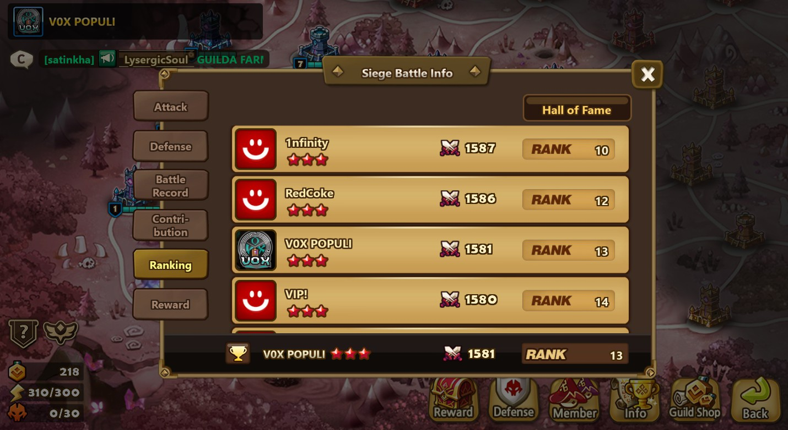

[Link to the repo](https://github.com/ngorki/SWRunes/)

A while ago, I started a project to help better understand the runes on my Summoners War account. I've used tools like [SWEX](https://github.com/Xzandro/sw-exporter/releases) for years to gather my account information in a JSON file and import that file into applications like [SWarFarm](https://www.swarfarm.com) (rip) to get detailed views of my account, [SWOP](https://tool.swop.one) to optimize monster builds, or [SWGT](https://www.swgt.io) to analyze rune depth. However, none of them gave me a simple way to graph or run custom analysis on my runes, at least that I saw. At the same time, I was transitioning into a new job, which was training me in Java and MySQL, so this provided a perfect opportunity to practice.

In essence, this projects goes through the file and maps the slightly encoded rune information to an easily readable table, not unlike the rune management table you might find on SWGT or SWOP. However, with a connection to a database, I can run all sorts of queries and connect it to an Excel sheet. I've found the Excel sheet to be the most fascinating. I've set up a histogram detailing the distribution of runes that can be filtered with a number of slicers, each filtering for a different attribute like rune type, rune slot, or main/sub stats. This lets me see where there is room to cull runes I've outgrown by farming better runes and spot gaps in the depth of my most valueable sets like Violent and Will. 

Since creating this tool and using it alongside the analysis features of SWGT, I've been able to bring up the rune quality of my account significantly. In August of 2024, my account had about 68% of the runes I needed to set a strong baseline of runes across important sets. Although the criteria changes depending on the set, reaching 100% meant having about 5-20 runes with an efficiency of 100% or higher and 3-8 runes with an efficiency of 110% or higher. Today, my account has 103.3% of the runes I need for a strong baseline.

This shows not only in the quality of my runes, but in recent top rank achievements. Since August, I've reached several new milestones. Just a few days ago, I finished rank 84 in Arena on the Global Server, putting me in the top 0.1% of Arena players on the server. This season of World Arena, a real-time battle mode against players in every server, I've reached a new peak rank, Punisher 3. Although the season is far from over and the ranks change every day, I've peaked at rank 3991 this season after hitting my previous record of rank 21171 last season. I've also joined a comfortably top 100 guild and played at the highest ranks of guild content, reaching a peak of rank 13 in siege and nearing top 100 in World Guild Battle, pitting us against some of the best players in the game. I'm hoping to continue to use this tool, alongside many others, to refine my runes and monsters and push even higher.

